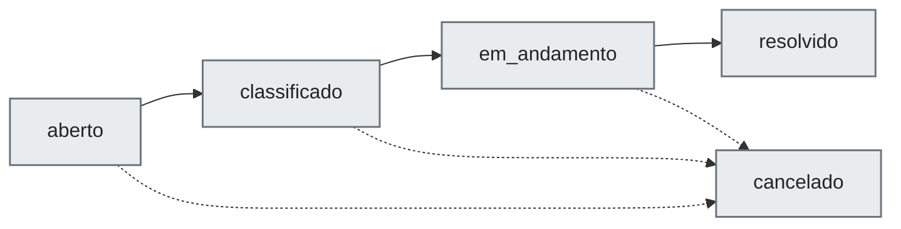
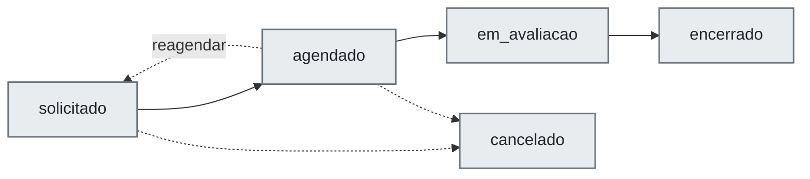
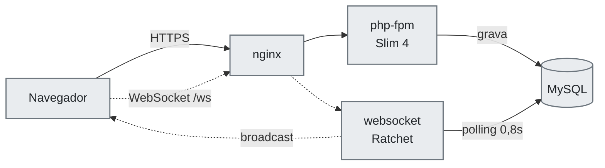

# Chat Interno + Chamados 

**Chat corporativo em tempo real e gestão de chamados de TI**

[](https://www.php.net/)
[](https://www.slimframework.com/)
[](http://socketo.me/)
[](https://www.mysql.com/)
[](https://docs.docker.com/compose/)
[](https://tailwindcss.com/)


---

Plataforma interna que junta, num único login, o **chat corporativo em tempo
real** e a **gestão de chamados de TI** — com agendamento de serviços,
relatórios e uma central de notificações.

Feita para rodar na infraestrutura da própria empresa — uma VM, Docker Compose,
rede local — sem depender de serviço externo: **nenhum dado de conversa ou
chamado sai do servidor.**

---

## Funcionalidades

| Módulo | O que faz |
|---|---|
| **Chat** | Conversas privadas, em grupo e por setor, em tempo real |
| **Chamados** | Abertura, triagem, atendimento e histórico |
| **Agendamentos** | Serviços agendados com aprovação e reagendamento |
| **Relatórios** | Filtros e exportação CSV |
| **Notificações** | Toast, som, sino e pop-up do sistema operacional |
| **Administração** | Usuários, setores, papéis e sessões |

### 💬 Chat

- Conversas **privadas**, em **grupo** e por **setor**.
- Mensagens em tempo real via WebSocket, com indicador de digitação, marcação de
  lida, contador de não lidas e exclusão de mensagem.
- Envio de anexos na conversa.
- Data da última mensagem na lista lateral — *Hoje* / *Ontem* / data — e busca
  de conversas.
- Administração do grupo — renomear, descrição, adicionar e remover
  participantes — direto pela lista.
- Presença online/offline dos usuários.

### 🎫 Chamados

Todo chamado nasce com **prioridade**, **categoria**, **subcategoria** e, se
precisar, anexos. Daí em diante ele caminha assim:



- Comentários técnicos com anexos e histórico por chamado.
- Acionamento de outro setor a partir do chamado.
- Tela **Meus chamados** para quem abriu e **Dashboard de TI** para quem
  atende.
- Taxonomias — categorias e subcategorias — editáveis pelo próprio time.

### 📅 Agendamentos

O usuário pede um serviço, o time de TI aprova, recusa ou propõe outro horário:



- **Painel de agendamentos** para o time de TI.
- Proposta de reagendamento, com aceite ou recusa do solicitante.
- Agendamentos vencidos migram sozinhos para `em_avaliacao` — rotina
  periódica no processo WebSocket.
- Catálogo de serviços agendáveis administrável.

### 📊 Relatórios

- Relatório de chamados com filtros e **exportação CSV**.

### 🔔 Notificações

- Central de notificações com sino, contador e histórico.
- **Toast** quando a janela está ativa e **pop-up do sistema operacional**
  quando está minimizada ou sem foco, mais som de alerta.


> O pop-up do sistema operacional exige **contexto seguro (HTTPS)**. Em
> `http://<ip>:8188` o navegador nega a permissão automaticamente — ver o
> passo **Habilitar HTTPS**, na execução.

### 🛡️ Administração

- CRUD de usuários e setores, com coluna de conexão — online / último acesso.
- Papéis `admin`, `ti` e `usuario`.
- Alterações sensíveis — editar ou excluir usuário — pedem a confirmação da
  senha do admin logado.
- Trocar e-mail, senha, papel ou desativar alguém **derruba a sessão daquela
  pessoa em todos os dispositivos**, na web e no WebSocket.

---

## Stack


**Backend**


**Tempo real e dados**


**Front-end**


**Infraestrutura**


| Camada | Tecnologia | Por quê |
|---|---|---|
| Linguagem | **PHP 8.3** *(mínimo 8.1)* | `strict_types` em todo arquivo |
| Framework HTTP | **Slim 4** + `slim/psr7` | roteamento enxuto, sem ORM |
| Tempo real | **Ratchet** *(porta 8080)* | WebSocket em processo próprio |
| Banco | **MySQL 8** | acesso por PDO, sem ORM |
| Front-end | **Tailwind + JS vanilla** | sem build step, sem `node_modules` |
| Servidor web | **nginx + PHP-FPM** | gzip ligado, proxy `/ws`, TLS opcional |
| Processos | **Supervisor** | mantém o servidor WebSocket vivo |
| Infra | **Docker Compose** | `mysql` · `php` · `nginx` · `websocket` |
| CI/CD | **GitHub Actions → Docker Hub** | lint de PHP + build das 3 imagens |


> O Tailwind é uma **cópia local** do CDN (`public/assets/js/tailwind.js`), não
> um script de terceiro: mantém o JIT em runtime sem bloquear a primeira pintura
> da tela nem depender de internet.

---

## 🏗️ Como a aplicação está organizada

Dois processos independentes, compartilhando o mesmo banco MySQL:



1. **HTTP** — `public/index.php` (Slim 4 atrás do nginx/PHP-FPM). Concentra
   todas as rotas de página e de API.
2. **WebSocket** — `bin/chat-server.php` → `App\Services\ChatServer` (Ratchet).

Não há fila nem barramento entre eles: **a integração é por polling do banco**.
O `ChatServer` varre mensagens, conversas e notificações novas a cada 0,8 s e
faz a manutenção dos agendamentos a cada 60 s. Na prática, um controller HTTP
que precisa avisar alguém só grava no banco — o broadcast sai sozinho no ciclo
seguinte.

```
projeto-chat-chamados/
├── 📂 app/
│   ├── Controllers/    # regras de negócio (falam PDO direto)
│   ├── Middleware/     # autenticação e autorização
│   ├── Services/       # ChatServer (WebSocket)
│   ├── Support/        # notificações, templates, helpers de schema
│   └── Helpers/        # respostas JSON padronizadas
├── ⚡ bin/chat-server.php  # entrada do processo WebSocket
├── ⚙️  config/          # conexão, schema.sql e bootstrap idempotente
├── 🐳 docker/          # imagens e configuração de nginx, php e websocket
├── 📚 docs/            # documentação complementar
├── 🌐 public/          # index.php (rotas) + assets (js/css) + uploads
├── 🧪 scripts/         # certificados TLS e testes de front em node
└── 🎨 templates/       # telas (HTML + PHP)
```

O schema tem **bootstrap idempotente** (`config/bootstrap.php`), não migrations:
tabelas e colunas novas são criadas e ajustadas automaticamente no boot, e os
setores padrão e o usuário admin são semeados na primeira execução.

---

##  Passo a passo para executar

###  Pré-requisitos

- Docker e Docker Compose instalados.
- 🔌 Portas livres no host: `8188` (HTTP), `8443` (HTTPS), `8080` (WebSocket) e
  `3307` (MySQL) — todas configuráveis no `.env`.

###  Clonar e configurar

```bash
git clone <url-do-repositorio>
cd projeto-chat-chamados
cp .env.docker.example .env
```

Edite o `.env` e troque, no mínimo:

| Variável | Para quê |
|---|---|
|  `APP_SECRET` | string aleatória de 64 caracteres |
|  `DB_PASS` / `DB_ROOT_PASS` | senhas do MySQL |
|  `ADMIN_EMAIL` / `ADMIN_PASSWORD` | conta admin criada no primeiro boot |
|  `WEB_HOST_PORT` / `WEB_HOST_PORT_HTTPS` | portas publicadas no host |
|  `SESSION_LIFETIME_DIAS` | duração do login (padrão: 7 dias) |
|  `UPLOAD_MAX_SIZE` / `UPLOAD_ALLOWED` | limite e tipos de anexo |

### Subir a stack

```bash
docker compose up -d --build
docker compose ps      # mysql, php, nginx e websocket devem ficar "healthy"
```

O primeiro boot cria o banco, aplica o schema e semeia setores e admin. Pode
levar alguns segundos até o MySQL ficar saudável.

### Acessar

| | Endereço |
|---|---|
| Aplicação | <http://localhost:8188/> — redireciona para `/chat` ou `/login` |
| WebSocket | `ws://localhost:8080` |

Credenciais iniciais (as do `.env`; por padrão):

- **E-mail:** `admin@empresa.com`
- **Senha:** `password`

> Troque a senha do admin logo no primeiro acesso.

### *(Recomendado)* Habilitar HTTPS

**O pop-up de notificação do navegador só funciona em contexto seguro.**

```bash
./scripts/gerar-certificados.sh chat.empresa.local 192.168.0.50   # CA interna + certificado
docker compose up -d --build nginx
docker logs chat_nginx | grep '\[nginx\]'                          # "TLS habilitado: ..."
```

Com o certificado no lugar, a aplicação responde em `https://localhost:8443/` e
o WebSocket passa a ser `wss://localhost:8443/ws`, proxiado pelo nginx. Instale
a CA gerada nas máquinas clientes.

 Detalhes em [`docs/notificacoes.md`](docs/notificacoes.md).

### 🐧 Rodar sem Docker

Guia dedicado: [`docs/rodar-sem-docker-na-vm.md`](docs/rodar-sem-docker-na-vm.md).
Migração de uma VM bare metal: [`docs/migration-guide.md`](docs/migration-guide.md).

---

## Comandos do dia a dia

```bash
docker compose up -d --build        # subir / rebuildar
docker compose ps                   # status dos serviços
docker compose restart websocket    # obrigatório após mudar código do WebSocket
docker compose restart php          # após mudar template ou código PHP (opcache)
docker logs -f chat_websocket       # acompanhar o servidor de tempo real
docker compose down                 # parar
docker compose down -v              # RESET TOTAL — apaga o volume do MySQL
```

> `docker compose down -v` remove o volume do MySQL: **todas as conversas,
> chamados e usuários são perdidos.**

Código PHP da aplicação HTTP é montado no container (`./:/var/www/html`), então
não exige rebuild; o servidor WebSocket, sim, carrega o código no boot do
processo.

Lint de um arquivo:

```bash
docker exec chat_php php -l app/Controllers/ChamadoController.php
```

---

## 🧪 Testes

Não há suíte formal — nem PHPUnit, nem linter configurado. Três scripts de node,
**sem nenhuma dependência**, cobrem a lógica de front que mais dá trabalho
quando quebra. Rodam da raiz do repositório:

```bash
node scripts/testar-avisos.js            # 🔔 toast x pop-up do SO x silêncio
node scripts/testar-menu-lateral.js      # 📐 minimizar/maximizar do menu lateral
node scripts/testar-transicao-pagina.js  # 🖱️ quais cliques contam como navegação
```

O CI (`.github/workflows/ci-cd-dockerhub.yml`, em push para `main`) valida o
`composer.json`, instala dependências, roda `php -l` em todos os arquivos PHP e
publica as três imagens no Docker Hub.

---

## 🗄️ Dados

Tabelas principais:

`setores` · `usuarios` · `conversas` · `participantes` · `mensagens` ·
`chamados` · `chamado_anexos` · `chamado_comentarios` ·
`chamado_comentario_anexos` · `chamado_taxonomias` · `servicos_agendamento` ·
`agendamentos` · `notificacoes` · `user_presenca`

- 🕒 Timezone fixo em `America/Sao_Paulo` — PHP HTTP, PHP WebSocket e sessão
  MySQL.
- 📎 Anexos ficam em disco (`public/uploads/`, volume `uploads_data`); o banco
  guarda apenas os metadados.

---

## Documentação complementar

| Arquivo | Assunto |
|---|---|
| [`docs/notificacoes.md`](docs/notificacoes.md) | Som, toast, sino, pop-up do SO e TLS — documento único do assunto |
| [`docs/onboarding-arquitetura-projeto.md`](docs/onboarding-arquitetura-projeto.md) | Visão de arquitetura para quem está chegando |
| [`docs/rodar-sem-docker-na-vm.md`](docs/rodar-sem-docker-na-vm.md) | Execução sem Docker |
| [`docs/migration-guide.md`](docs/migration-guide.md) | Migração de VM bare metal |
| [`docs/REFACTOR.md`](docs/REFACTOR.md) | Histórico de refatorações |
| [`CLAUDE.md`](CLAUDE.md) | Convenções e armadilhas do código |

O catálogo de rotas — páginas e API — vive em `public/index.php`: é o arquivo
único onde todo endpoint é declarado.

---
